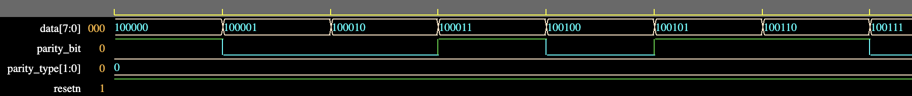

# UART Module
## UART Implementation using SystemVerilog

- [UART Module](#uart-module)
  - [UART Implementation using SystemVerilog](#uart-implementation-using-systemverilog)
  - [Overview](#overview)
  - [Features](#features)
  - [UART Transmitter](#uart-transmitter)
    - [Circuit Diagram](#circuit-diagram)
    - [Parity Bit Generator](#parity-bit-generator)
    - [Baud Rate Generator](#baud-rate-generator)
    - [PISO Shift Register](#piso-shift-register)

## Overview
This projects involves designing and implementing a *Universal Asynchronous Receiver/Transmitter(UART)* using SystemVerilog to transmit and receive serial data. UART is a physical circuit and includes a Transmitter and Receiver.

## Features
- **Full Duplex Operation**
- **Configurable Baud Rate**
- **Configurable Data Length**
- **Optional Error Correction (parity checking)**

## UART Transmitter
The UART Tx circuit includes a Baud Rate Generator, Parity Bit Generator and a Parallel-In-Serial-Out (PISO) Shift Register.

### Circuit Diagram

### Parity Bit Generator
Supports 3 possible parity types:
- No Parity
- Odd Parity
- Even Parity

**Synthesis - Circuit Diagram**

**Even Parity Simulation**

**Odd Parity Simulation**

### Baud Rate Generator
Supports 4 possible baud rates(based on 36MHz clock rate):
- 4800 bps
- 9600 bps
- 19200 bps
- 38400 bps

**Synthesis - Circuit Diagram**

**4800bps Baud Rate Simulation**

**9600bps Baud Rate Simulation**

**19600bps Baud Rate Simulation**

**39400bps Baud Rate Simulation**

### PISO Shift Register
Takes in data and parity bit and sends out as serial data along with UART frame data.
Supports data length of 5-8 bits.

**FSM State Diagram**

**Simulation**
- 8 bit data length
- Parity Bit included
- Serial data is sent out least significant bit first

